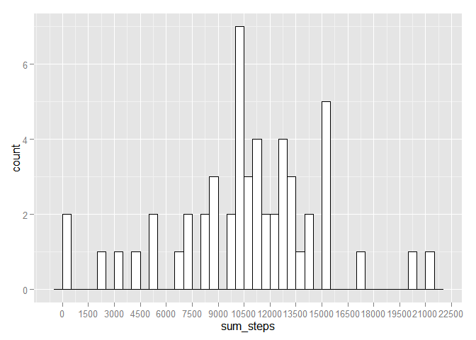
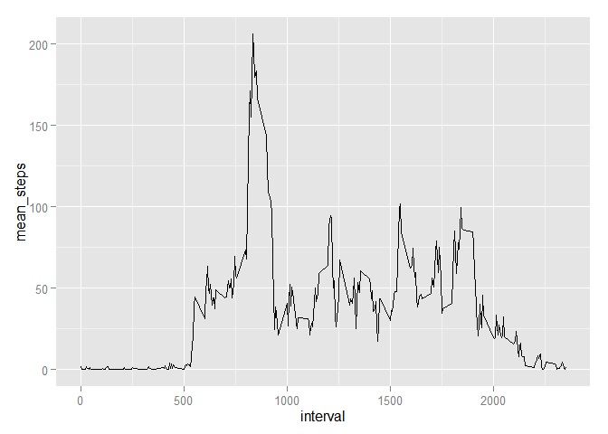
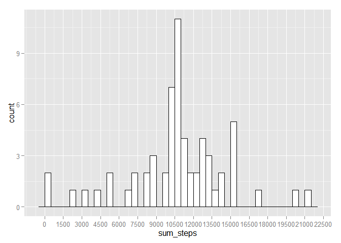
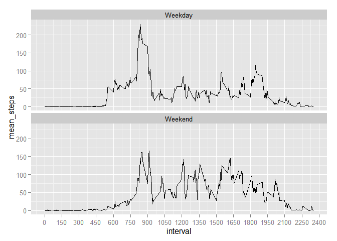

# Reproducible Research: Peer Assessment 1

<<<<<<< HEAD
This is an R Markdown document for the Peer Assignment 1 of the Reproducible Research course on Coursera. This assignment makes use of data from a personal activity monitoring device. This device collects data at 5 minute intervals through out the day. The data consists of two months of data from an anonymous individual collected during the months of October and November, 2012 and include the number of steps taken in 5 minute intervals each day.

## Data description

The data for this assignment was downloaded from https://d396qusza40orc.cloudfront.net/repdata%2Fdata%2Factivity.zip as of 8:00 PM October 13th, 2015.

The variables included in this dataset are:


steps: Number of steps taking in a 5-minute interval (missing values are coded as NA)

date: The date on which the measurement was taken in YYYY-MM-DD format

interval: Identifier for the 5-minute interval in which measurement was taken


The dataset is stored in a comma-separated-value (CSV) file and there are a total of 17,568 observations in this dataset.

The following is the code of the project and its corresponding output:

## Loading and preprocessing the data


```r
data<-read.csv(file="activity.csv")
head(data,10)
```

```
##    steps       date interval
## 1     NA 2012-10-01        0
## 2     NA 2012-10-01        5
## 3     NA 2012-10-01       10
## 4     NA 2012-10-01       15
## 5     NA 2012-10-01       20
## 6     NA 2012-10-01       25
## 7     NA 2012-10-01       30
## 8     NA 2012-10-01       35
## 9     NA 2012-10-01       40
## 10    NA 2012-10-01       45
```

```r
#We convert the variable date into a proper date format
data$date<-as.POSIXct(data$date,format="%Y-%m-%d")                        
```

## What is the mean total number of steps taken per day?

```r
library(dplyr)
```

```
## 
## Attaching package: 'dplyr'
## 
## The following objects are masked from 'package:stats':
## 
##     filter, lag
## 
## The following objects are masked from 'package:base':
## 
##     intersect, setdiff, setequal, union
```

```r
library(ggplot2)

#Groups data by date
data_day<-group_by(data,date)

#Calculates the total number of steps taken by day
total_steps_day<-summarize(data_day,sum(steps))

#Renames the total steps variable for clarity
total_steps_day<-rename(total_steps_day,sum_steps=`sum(steps)`)

#Calculates the mean number of steps taken by day
mean_steps_day<-summarize(data_day,mean(steps,na.rm=TRUE))

#Calculates the median of the number of steps taken by day
median_steps_day<-summarize(data_day,median(steps,na.rm=TRUE))

#Renames the mean and median steps variables for clarity
mean_steps_day<-rename(mean_steps_day,mean_steps=`mean(steps, na.rm = TRUE)`)
median_steps_day<-rename(median_steps_day,median_steps=`median(steps, na.rm = TRUE)`)

#Shows the means for each day
mean_steps_day
```

```
## Source: local data frame [61 x 2]
## 
##          date mean_steps
##        (time)      (dbl)
## 1  2012-10-01        NaN
## 2  2012-10-02    0.43750
## 3  2012-10-03   39.41667
## 4  2012-10-04   42.06944
## 5  2012-10-05   46.15972
## 6  2012-10-06   53.54167
## 7  2012-10-07   38.24653
## 8  2012-10-08        NaN
## 9  2012-10-09   44.48264
## 10 2012-10-10   34.37500
## ..        ...        ...
```

```r
#Shows the median for each day
median_steps_day
```

```
## Source: local data frame [61 x 2]
## 
##          date median_steps
##        (time)        (dbl)
## 1  2012-10-01           NA
## 2  2012-10-02            0
## 3  2012-10-03            0
## 4  2012-10-04            0
## 5  2012-10-05            0
## 6  2012-10-06            0
## 7  2012-10-07            0
## 8  2012-10-08           NA
## 9  2012-10-09            0
## 10 2012-10-10            0
## ..        ...          ...
```

<<<<<<< HEAD
```r
#Show the total mean of steps taken by day
meantotal<-summarize(total_steps_day,mean(sum_steps,na.rm=TRUE))
meantotal
```

```
## Source: local data frame [1 x 1]
## 
##   mean(sum_steps, na.rm = TRUE)
##                           (dbl)
## 1                      10766.19
```

```r
#Show the total median of steps taken by day
mediantotal<-summarize(total_steps_day,median(sum_steps,na.rm=TRUE))
mediantotal
```

```
## Source: local data frame [1 x 1]
## 
##   median(sum_steps, na.rm = TRUE)
##                             (int)
## 1                           10765
```

=======
>>>>>>> 8e5b844fe1124702e53ffbce1581a641c904a77c
Plot of the total number of steps taken by day:

```r
#Plot the total steps by day
histo<-ggplot(total_steps_day,aes(x=sum_steps))
histo<-histo+geom_histogram(binwidth = 500, colour="black", fill="white")
histo<-histo + scale_x_continuous(breaks=seq(0,22500,1500))
histo
```

 

## What is the average daily activity pattern?

```r
#Groups data by interval
data_interval<-group_by(data,interval)

#Calculates the mean number of steps taken by interval
mean_steps_interval<-summarize(data_interval,mean(steps,na.rm=TRUE))

#Renames the mean steps variable for clarity
mean_steps_interval<-rename(mean_steps_interval,mean_steps=`mean(steps, na.rm = TRUE)`)

#Plot the total steps by day
time<-ggplot(mean_steps_interval,aes(x=interval,y=mean_steps))
time<-time+geom_line(stat='identity',type='l')
time
```

 

The maximum number of steps was:

```r
#Calculates and prints max steps
max_steps<-max(mean_steps_interval$mean_steps)
max_steps
```

```
## [1] 206.1698
```

The maximum number of steps was registered in the interval:

```r
#Prints the interval with the highest number of steps   
mean_steps_interval$interval[which.max(mean_steps_interval$mean_steps)]
```

```
## [1] 835
```

## Imputing missing values

We will impute the missing values by using the means of the interval where the missing value is located across all the days.

```r
#Calculates the total number of NAs in the data
missing<-data[is.na(data$steps)==TRUE,]
```

The number of missing values is:

```r
#Reports the number of rows with missing values
nrow(missing)
```

```
## [1] 2304
```

```r
#Creates means of steps taken by interval of the day for imputation
data_impute<-group_by(data,interval)
data_impute_means<-summarize(data_impute,mean(steps,na.rm=TRUE))
data_impute_means<-rename(data_impute_means,means_impute=`mean(steps, na.rm = TRUE)`)

#Stores a backup of the original data without imputations in data_original
data_original<-data

#Preliminary step before imputing
data<-merge(data,data_impute_means,by=c("interval","interval"),all=TRUE)

#Imputes missing values with the means for that interval. 
#THE DATAFRAME "DATA" HAS THE IMPUTED VALUES, "DATA_ORIGINAL" IS THE ORIGINAL DATASET

for (i in seq_len(nrow(data)))
{
        if (is.na(data$steps[i])==TRUE)
        {
            data$steps[i]<-data$means_impute[i]
        }
}

#Groups data by date
data_day2<-group_by(data,date)

#Calculates the total number of steps taken by day
total_steps_day2<-summarize(data_day2,sum(steps))

#Renames the total steps variable for clarity
total_steps_day2<-rename(total_steps_day2,sum_steps=`sum(steps)`)

#Calculates the mean number of steps taken by day
mean_steps_day2<-summarize(data_day2,mean(steps,na.rm=TRUE))

#Calculates the median of the number of steps taken by day
median_steps_day2<-summarize(data_day2,median(steps,na.rm=TRUE))

#Renames the mean steps variable for clarity
mean_steps_day2<-rename(mean_steps_day2,mean_steps=`mean(steps, na.rm = TRUE)`)

#Shows the means for each day
mean_steps_day2
```

```
## Source: local data frame [61 x 2]
## 
##          date mean_steps
##        (time)      (dbl)
## 1  2012-10-01   37.38260
## 2  2012-10-02    0.43750
## 3  2012-10-03   39.41667
## 4  2012-10-04   42.06944
## 5  2012-10-05   46.15972
## 6  2012-10-06   53.54167
## 7  2012-10-07   38.24653
## 8  2012-10-08   37.38260
## 9  2012-10-09   44.48264
## 10 2012-10-10   34.37500
## ..        ...        ...
```

```r
#Shows the median for each day
median_steps_day2
```

```
## Source: local data frame [61 x 2]
## 
##          date median(steps, na.rm = TRUE)
##        (time)                       (dbl)
## 1  2012-10-01                    34.11321
## 2  2012-10-02                     0.00000
## 3  2012-10-03                     0.00000
## 4  2012-10-04                     0.00000
## 5  2012-10-05                     0.00000
## 6  2012-10-06                     0.00000
## 7  2012-10-07                     0.00000
## 8  2012-10-08                    34.11321
## 9  2012-10-09                     0.00000
## 10 2012-10-10                     0.00000
## ..        ...                         ...
```

```r
#Plot the total steps by day
histo2<-ggplot(total_steps_day2,aes(x=sum_steps))
histo2<-histo2+geom_histogram(binwidth = 500, colour="black", fill="white")
histo2<-histo2 + scale_x_continuous(breaks=seq(0,22500,1500))
histo2
```

 

## Are there differences in activity patterns between weekdays and weekends?

```r
#Adds the weekday variable, weekday by default
data<-mutate(data, weekday="Weekday")

#Adjusts the variable for weekends
for (i in seq_len(nrow(data)))
{
        if (weekdays(data$date[i])=="Saturday" | weekdays(data$date[i])=="Sunday")
        {
            data$weekday[i]<-"Weekend"
        }
}

#Converts weekday into a factor
data$weekday<-as.factor(data$weekday)

#Groups data by weekday and interval
data_week<-group_by(data,weekday,interval)

#Calculates the mean steps by interval and day type
data_week_mean<-summarize(data_week,mean(steps))

#Renames mean for convenience
data_week_mean<-rename(data_week_mean,mean_steps=`mean(steps)`)

#Plots the mean steps by interval in 2 facets by day of the week type
panel<-ggplot(data_week_mean,aes(x=interval, y=mean_steps))
panel<-panel+geom_line(stat='identity',type='l')
panel<-panel+facet_wrap(~weekday,nrow=2,ncol=1,shrink=FALSE)
panel<-panel + scale_x_continuous(breaks=seq(0,2500,150))
panel
```

 
=======
